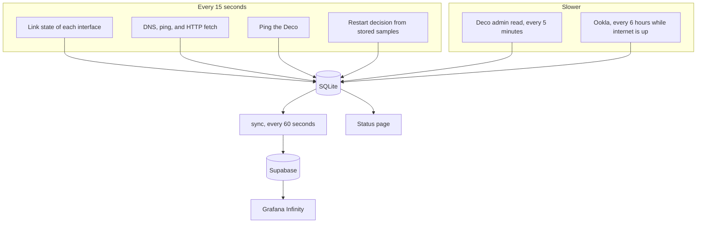
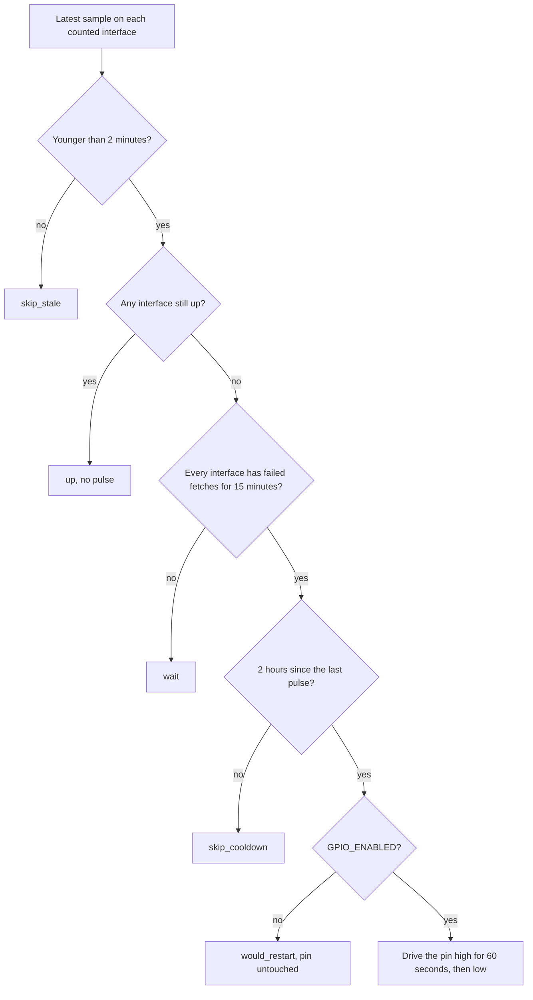
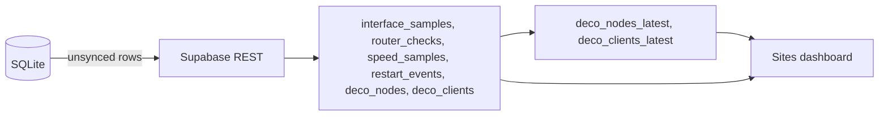

# How netwatch works

Each site runs the same five programs. They share one SQLite file on that machine. A sync program copies new rows to one Supabase project. Grafana, on the machine you keep at home, reads Supabase and draws every site on one dashboard.

A row is tagged with `SITE_ID`. The laptop uses `localDev`. The Pi 2 needs its own id, or the two machines overwrite each other's story.

## Where it runs

```mermaid
flowchart LR
  subgraph home ["Home machine, Docker"]
    mon5[monitor]
    spd5[speedtest]
    syn5[sync]
    rst5[restart]
    web5[status :16081]
  end
  subgraph grafpi ["Grafana Pi 5, no Docker"]
    graf[Grafana :16080]
  end
  subgraph pi2 ["Pi 2, systemd, no Docker"]
    mon2[monitor]
    spd2[speedtest]
    syn2[sync]
    rst2[restart]
    web2[status :16081]
  end
  deco[Deco at 192.168.68.1]
  sb[(Supabase)]
  mon5 --> deco
  mon2 --> deco
  syn5 --> sb
  syn2 --> sb
  graf --> sb
  web5 --> graf
```

The Pi 2 does not run Grafana. Its status page skips the Grafana health check because `GRAFANA_HEALTH_URL` is empty. Charts for that site appear on the Grafana Pi after sync. That Pi runs the Grafana package only: `scripts/setup-grafana.py` writes the Supabase URL, secret key, and admin password, and `scripts/install-grafana.sh` installs Grafana 13.2.2 and the Infinity plugin. No monitor and no Docker.

Docker services use host networking for monitor, speed test, sync, and restart, so they see the real interfaces. Status and Grafana are published on ports 16081 and 16080. SQLite lives on the `netwatch-data` volume. Do not bind-mount that file from macOS: Docker Desktop corrupts a WAL database that the host and a container both open.

On the Pi 2 the same programs are systemd units named `netwatch-monitor`, `netwatch-speedtest`, `netwatch-sync`, `netwatch-restart`, and `netwatch-status`. Config is `/etc/netwatch/netwatch.env`. Secrets are `/etc/netwatch/secrets`. Data is `/var/lib/netwatch`. The Python install is `/opt/netwatch/venv`. `systemctl enable --now` does not restart a unit that is already running. After `git pull` and `install-pi2.sh`, restart the units so they load the new code.

GitHub Actions builds the status page and commits `web/dist` on `main`. The Pi 2 installer copies that build. It does not run Node.

## What each program does

| Program | Command | Writes |
|---|---|---|
| monitor | `netwatch-monitor` | `interface_samples`, `router_checks`, `deco_nodes`, `deco_clients` |
| speedtest | `netwatch-speedtest` | `speed_samples` |
| sync | `netwatch-sync` | copies unsynced rows, then deletes expired ones |
| restart | `netwatch-restart` | `restart_events`, and the GPIO pin when a pulse is allowed |
| status | `netwatch-status` | nothing; reads SQLite and serves port 16081 |

Interface samples are written when the result changes, and at least once a minute. The monitor still probes every 15 seconds.

## Internet check

For each interface that is up, the monitor checks:

- DNS for `google.com`, `cloudflare.com`, and `microsoft.com`, plus `google.com` against `1.1.1.1` and `8.8.8.8`
- Ping of `8.8.8.8` and `1.1.1.1`
- HTTP fetch of Google `generate_204`, Microsoft `connecttest.txt`, and Cloudflare's trace endpoint

`internet_ok` is true when at least one fetch returns the expected body or status. DNS and ping are stored beside that, but they do not by themselves count as internet.

`LINK_MODE=auto` counts every link that is up. On a Mac, Docker Desktop shows the VM interface `eth0`, not the laptop's Wi-Fi. A Pi on host networking shows the real interfaces.

## Restart

The restart program does not probe the network. It reads the samples the monitor already stored.

The relay is normally closed. GPIO low means the router stays on. A hardware pull-down keeps the router on if the Pi loses power. On process start, if a pulse was in progress, the pin is driven low before anything else.

When GPIO is off, a would-be restart is still recorded, so the dashboard shows the decision without cutting power.

## Deco

About every 5 minutes the monitor logs into `https://192.168.68.1` and reads the same forms the web page uses: WAN, LAN, internet status, Wi-Fi bands, mesh nodes, clients, and CPU/memory.

The login form has no username. The page still signs requests as `md5("admin" + password)`. A blank `DECO_USER` is treated as `admin`. The password is read from `secrets/deco_password` and is never written to SQLite, Supabase, or the logs.

One Deco admin session is kept. If the laptop monitor and the Pi 2 monitor both log in, they knock each other off. Leave Deco polling to the machine that should own it.

Stored for Grafana:

- Internet: online/offline, PPPoE or other type, WAN address, gateway, primary DNS, LAN address, client count, CPU, memory
- Nodes: name, role, model, firmware, IP, internet and mesh status
- Clients: name, IP, wired / 2.4G / 5G, live up and down in KB/s
- Wi-Fi: band on or off, channel, mode, guest/MLO/IoT on or off

Wi-Fi passwords and the PPPoE username are not stored.

A failed Deco login is recorded on `router_checks` and does not move the outage timer. Too many failures set `/var/lib/netwatch/deco.lock` (or `/data/deco.lock` in Docker) and pause login for two hours.

## Speed test

Ookla is the only source: `speedtest --accept-license --accept-gdpr --format=json`. There is no fast.com run and no unofficial Speedtest Python package.

The CLI aborts with `basic_string::_M_construct null not valid` when `HOME` or the locale is unset, which is how systemd starts a process. The speed-test unit sets `HOME=/var/lib/netwatch` and `LANG=C.UTF-8`, and the wrapper fills those in if they are still blank. The Pi 2 installer downloads the Debian armhf Ookla package. The Raspbian apt repo for Trixie does not exist, so the installer removes that source list before `apt-get update`.

A test runs when the restart decision is `up`, on the schedule in `/var/lib/netwatch/speedtest.schedule` (default 6 hours). The status page can request one immediately by writing `speedtest.request`. A failed test is retried on the same interval unless `SPEEDTEST_RETRY_SECONDS` is set.

## Storage and sync

SQLite is the source of truth on each machine. Supabase is the copy Grafana reads. Sync wakes every 60 seconds, inserts rows whose `synced_at` is null, then marks them. The remote primary key is `(site_id, local_id)`, where `local_id` is the SQLite row id.

`supabase/001_init.sql` creates the original four tables. `supabase/002_deco_inventory.sql` adds the WAN columns, the node and client tables, and the latest-row views. Sync applies every file in the SQL directory when a Supabase access token is configured. The service-role key used for inserts cannot create tables. Without an access token, run both files once in the Supabase SQL editor.

Retention:

| Rows | On the Pi, after sync | On the Pi, even if unsynced | In Supabase |
|---|---|---|---|
| Interface samples, router checks, Deco nodes, Deco clients | 48 hours | 7 days | 30 days |
| Speed tests | 90 days | 90 days | 1 year |
| Restart events | 1 year | 1 year | 1 year |

Row level security is enabled and no policies are defined. The service-role key bypasses it. The anon and publishable keys cannot read the tables.

## Status page and Grafana

The status service serves `web/dist` and a small JSON API:

- `GET /api/status` — latest interface, router, speed, and restart rows
- `GET /api/connectivity` — SQLite, Supabase, and Grafana health
- `GET` and `POST /api/speedtest/schedule` — the Ookla interval
- `POST /api/speedtest` — ask the speed-test process to run now
- `POST /api/restart/simulate` — record the restart decision without pulsing the pin
- `GET /api/logs` — the local log tail

Grafana 13.2.2 uses the Infinity plugin. Its entrypoint copies the dashboard, substitutes the Supabase URL, and sends the service-role key as `apikey` and `Authorization`. The Sites dashboard shows internet up/down, Ookla throughput, Deco ping, restart events, and the current Deco internet, nodes, and clients.

## Secrets

| File | What it is |
|---|---|
| `netwatch.env` | `SITE_ID`, Deco address, `DECO_USER`, interfaces, Supabase URL, GPIO |
| `secrets/deco_password` | Deco admin password |
| `secrets/supabase_key` | Secret key (`sb_secret_...`) or the `service_role` JWT |
| `secrets/grafana_admin_password` | Only on the machine that runs Grafana |
| `secrets/supabase_access_token` | Optional `sbp_...` token so sync can apply SQL |

On a Pi these live under `/etc/netwatch`. On a laptop, `~/.netwatch`. Mode on the secret files is owner-read/write. Do not commit them.
